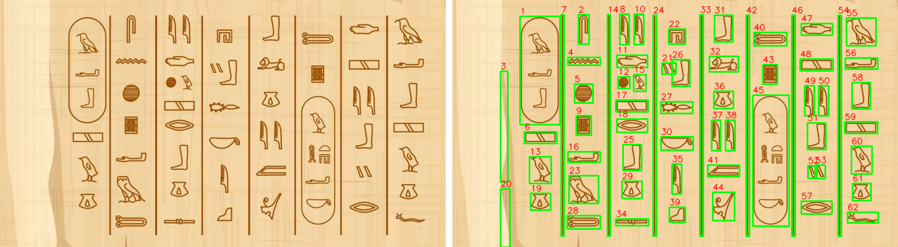

# Hieroglyph Character Detection (OCR)

Finds individual hieroglyph signs in a photo of an inscription and saves each one as a cropped image, numbered in approximate reading order. The crops are then passed to a classifier.

This repo is the **character detection (OCR) module** of *Hieroglyph Signs Decoding*, a B.Sc. graduation project at Helwan University (2020/2021). The project was a Flutter app that photographs a hieroglyphic inscription, classifies each sign as a Gardiner code, and translates the result into English.



*Left: input photo (`Images/simple.jpg`). Right: each detected sign boxed and numbered. Note that the carved separator lines are also boxed (a known limitation, see below).*

## Why it's hard

There are no off-the-shelf OCR models for hieroglyphs: Tesseract and EasyOCR don't support them. On top of that:

- There are more than 1,000 distinct signs, and very little labelled text to train on.
- Text can run in rows or columns, left-to-right or right-to-left. The direction is shown by which way human and animal figures face.
- Signs are stacked: within a column, upper signs are read before lower ones.

This module uses classical computer vision (OpenCV) instead of a trained model.

## Pipeline

```
input image ─► R2L=True: flip horizontally
            ─► grayscale + Gaussian blur
            ─► Canny edges ─► dilation
                 ├─ findContours (area > 100) ─► candidate sign boxes
                 └─ HoughLinesP + HoughBundler ─► separator lines (or none)
            ─► order signs, assign each to a line
            ─► crop each sign ─► save as L{line}Q{order}.jpg
```

| Step | Purpose |
|---|---|
| Flip (`R2L=True`) | Right-to-left text is mirrored so it is processed as left-to-right. The saved crops are mirrored too. |
| Grayscale + blur | Removes colour and Gaussian noise before edge detection |
| Canny | Edge map. It gave better results than Sobel, Prewitt or Laplacian on this data |
| Dilation (3×3) | Thickens edges so `findContours` gets closed shapes |
| `HoughLinesP` + `HoughBundler` | Finds the carved separator lines, merges broken segments, and decides whether the text is horizontal or vertical. If there are no lines, every sign is assigned to line 1 |
| Contours (area > 100) | Candidate signs. Each one is assigned to a line (1 + the number of separator lines before it) and ordered by the distance of its centre from the top-left corner |

## Quick start

```bash
git clone https://github.com/omar005/Hieroglyph-Signs-Decoding.git
cd Hieroglyph-Signs-Decoding
pip install -r requirements.txt
python demo.py
```

From Python:

```python
from Characters_Detection import Characters_Detection

detector = Characters_Detection("Images/hori.jpg", R2L=False)
detector.getCharacters("output/")   # creates output/ if needed
```

From the command line:

```bash
python detect.py Images/hori.jpg --direction ltr --out output/
python detect.py Images/egyptianTexts5.jpg --direction rtl --out output/ --annotate output/annotated.png
```

`--direction rtl` is for text whose human/animal figures face right. `--annotate` also saves the input with numbered boxes, like the image above.

Output files are named `L<line>Q<order>.jpg`. `L` is the line (row or column) the sign was assigned to, and `Q` is its order index across the whole image. For example, `L2Q14.jpg` is the 14th sign overall, found on line 2. Existing files in the output folder are not deleted, so use a fresh folder for each image.

## Repository layout

```
├── Characters_Detection.py   # main detection class
├── detect.py                 # command-line interface
├── demo.py                   # runs the detector on a sample image
├── requirements.txt
├── classes/
│   ├── HoughBundler.py       # line clustering/merging (adapted, see Credits)
│   └── stackImages.py        # debug helper to tile intermediate images
├── Images/                   # sample inscriptions
├── notebooks/                # exploration notebooks
└── docs/
    ├── report.pdf            # full project report
    ├── presentation.pdf      # project slides
    ├── example.png           # figure used above
    └── make_example.py       # regenerates example.png
```

The notebooks are early experiments. Some of them refer to sample images that were removed from `Images/` to keep the repo small; they are still in the git history.

## Known limitations

From testing on the sample images:

- Carved separator lines are sometimes detected as signs.
- Some signs are detected twice, or merged with a neighbouring sign.
- Signs are ordered by their distance from the top-left corner, which only approximates reading order. On wide, multi-line images, signs from neighbouring lines can interleave in the numbering. The `L` number in the file name tells you the line.
- When there are no separator lines, two columns can be merged and read in the wrong order.
- A cartouche is detected as a single object rather than as the signs inside it.
- Background texture can produce false detections, for example on `himg.jpg`.

## Future work

- Sort signs by line first and by position within the line, instead of by distance from the corner.
- Remove separator lines from the detected signs.
- Detect cartouches and recurse into them. The project report describes cartouche and space detection, but they are not implemented in this code.
- Use horizontal or vertical dilation kernels to split text lines when there are no separators.
- Use Tesseract or EasyOCR to mask out any modern text before detection.
- Let users correct detections inside the app.
- Use the photo's location (temple or museum) to match against texts that have already been translated.

## Team

This module was written by **Omar Mohamed Othman Ahmed**.

Full project team: Remon Samir Zaki, Omar Mohamed Othman Ahmed, Michael Samir Youssef Fam, Amr Ahmed Mohamed Mahmoud, Ahmed Khalil Mohamed Khalil, Mohammed Rabie Khames.
Supervisor: Assoc. Prof. Shahira, Faculty of Engineering, Helwan University.

## Credits

- `HoughBundler` is based on [banderlog013's Stack Overflow answer](https://stackoverflow.com/a/50389879/14263835), with `chk_L_V`, `chk_I_V` and `completeLines` added.
- `stackImages` is adapted from Murtaza's Workshop OpenCV tutorial.

## License

MIT. See [LICENSE](LICENSE).
